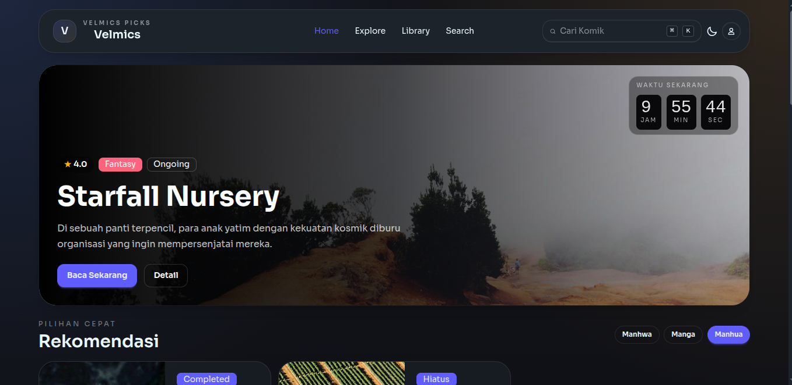
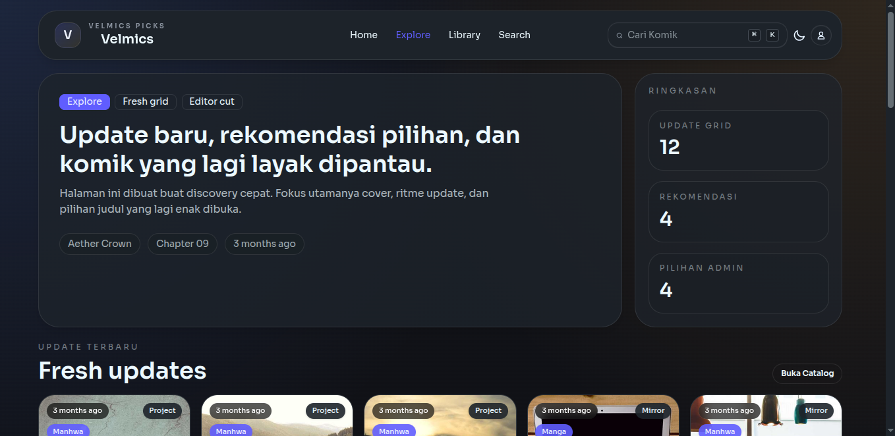
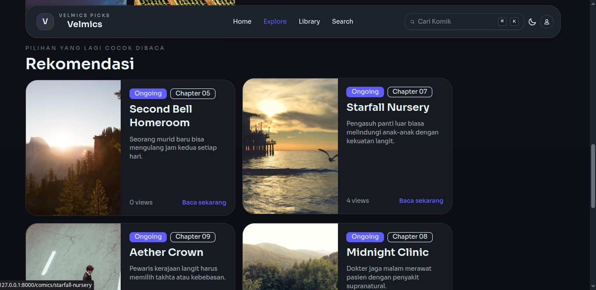
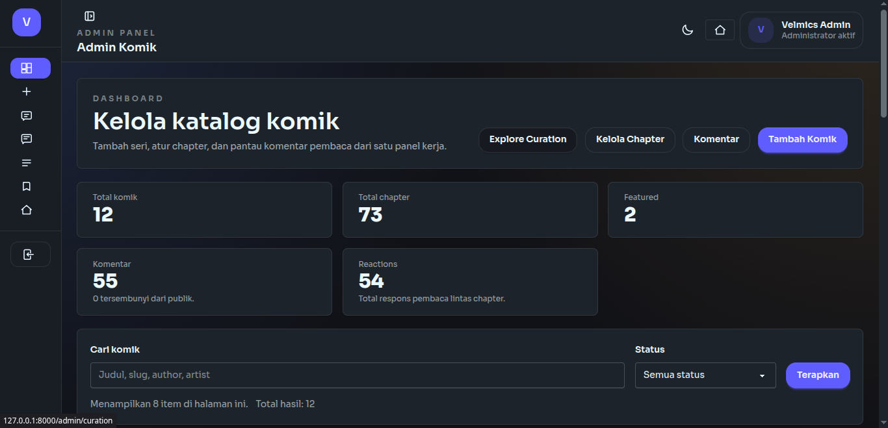

# Web-Comic (comick)

**Portal komik digital + comic reader** berbasis **Laravel**.

## Tujuan Aplikasi

Aplikasi ini menyediakan:
- **Portal komik digital** untuk browsing/katalog, eksplorasi, dan kurasi.
- **Reader** untuk membaca chapter (page-by-page) serta interaksi pembaca.

## Fitur Utama
### 1) Portal & Katalog
- **Catalog / Explore**: daftar dan eksplor komik.

- **Curation / Rekomendasi**: penandaan fitur (featured/recommended/admin pick) pada katalog.


### 2) Rak Baca & Riwayat
- **Rak baca / Bookmark**
- **Read list**
- **History** (riwayat pembacaan)


### 3) Reader & Interaksi Pembaca
- Reader chapter dengan navigasi halaman.
- **Feedback/Comment**:
  - komentar chapter
  - komentar komik
- **Vote & Reaction** (mis. like/dislike, reaksi tipe tertentu)


### 4) Admin Panel & Moderasi
- **Admin panel** untuk pengelolaan konten (mis. komik/chapter).
- **Moderasi pengguna & konten** (field moderasi pada tabel `users`).
- **Captcha** untuk pembuatan/submit form (contoh implementasi `App\Support\FormCaptcha`).
- **2FA admin** menggunakan challenge berbasis session (`App\Support\AdminTwoFactor`).


## Arsitektur Singkat
- Backend: **Laravel** (Blade, Eloquent, MVC)
- Frontend: **Vite + TailwindCSS + DaisyUI**
- Build assets: `npm run dev` / `npm run build`

## Prasyarat
- **PHP >= 8.2**
- Composer
- Node.js + npm
- Database (MySQL/MariaDB/PostgreSQL/SQLite sesuai konfigurasi)

## Cara Mulai (Setup Lokal)
1. **Clone repo**
2. **Install dependencies PHP**
   ```bash
   composer install
   ```
3. **Install dependencies frontend**
   ```bash
   npm install
   ```
4. **Siapkan file environment**
   Copy `.env.example` ke `.env` (jika belum ada)
     ```bash
     cp .env.example .env
     ```
5. **Generate application key**
   ```bash
   php artisan key:generate
   ```
6. **Migrasi database**
   ```bash
   php artisan migrate --force
   ```
7. **Seed data dummy**
   - Data admin default, demo komik, dan engagement reader.
   ```bash
   php artisan db:seed --force
   ```
   - Seeder yang dipakai:
     - `DatabaseSeeder`
     - `AdminUserSeeder`
     - `DemoComicSeeder`
     - `DemoReaderEngagementSeeder`

8. Jalankan mode development:
   ```bash
   npm run dev
   ```
   Lalu jalankan server Laravel (di terminal lain):
   ```bash
   php artisan serve
   ```

   Untuk build production:
   ```bash
   npm run build
   ```

## Akun Default Admin
Akun admin default dibuat oleh **`database/seeders/AdminUserSeeder.php`** menggunakan env berikut:
- `ADMIN_DEFAULT_NAME`
- `ADMIN_DEFAULT_EMAIL`
- `ADMIN_DEFAULT_PASSWORD`

Jika env tidak diset, fallback default dari seeder adalah:
- **Name**: `Velmics Admin`
- **Email**: `admin@velmics.test`
- **Password**: `password`

Setelah `php artisan db:seed`, login admin melalui halaman admin.

> Catatan keamanan: ubah nilai `ADMIN_DEFAULT_*` sebelum deployment.

## Contoh `.env`
Buat/isi minimal contoh berikut (sesuaikan DB Anda):

```env
APP_URL=http://localhost:8000
APP_ENV=local
APP_DEBUG=true

# Database
DB_CONNECTION=mysql
DB_HOST=127.0.0.1
DB_PORT=3306
DB_DATABASE=web_comick
DB_USERNAME=root
DB_PASSWORD=

# Jika aplikasi memakai email (opsional)
# MAIL_MAILER=smtp
# MAIL_HOST=mail.example.com
# MAIL_PORT=587
# MAIL_USERNAME=user
# MAIL_PASSWORD=secret
# MAIL_FROM_ADDRESS=admin@example.com

# Admin default (dipakai oleh AdminUserSeeder)
ADMIN_DEFAULT_NAME="Velmics Admin"
ADMIN_DEFAULT_EMAIL="admin@velmics.test"
ADMIN_DEFAULT_PASSWORD="password"
```

## API & Dokumentasi
Dokumentasi API tersedia di:
- `docs/api/README.md`
- `docs/api/web-comick.postman_collection.json`

---
## Troubleshooting Singkat
- Jika asset frontend tidak tampil setelah setup, jalankan ulang:
  ```bash
  npm run dev
  ```
- Jika seed gagal karena tabel belum ada, pastikan migrasi sudah dijalankan dulu:
  ```bash
  php artisan migrate --force
  ```

